## Petrol Station

    Simplified simulation of petrol station.

## Table of contents
* [General info](#general-info)
* [Technologies](#technologies)
* [Features](#features)
* [Setup](#setup)
* [Acknowledgements](#Acknowledgements)
* [Extras](#Extras)

## General info
* Database diagram 

.JPG) 

## Features

### Stored Procedures -> Time period for analysis presented on screenshots examples: years 2020-2022
* 

  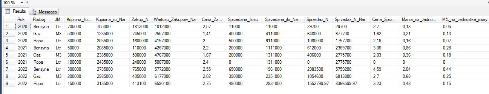

* 

  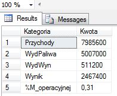
  
  
* 

### Cash flow is divided into two periods: past and future (forecast). If user provide data only from the past column 'Prognoza' will be empty.
### If user provide data only from future column 'Realny' will be empty.
### If user provide data which starts in past and ends in future cash flow will be divided appropriately into this two columns ('Realny','Prognoza').  

  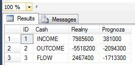
    

* 

  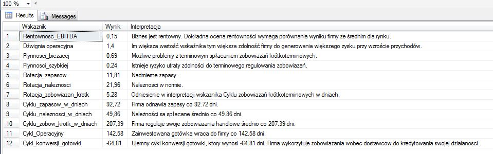

* 

  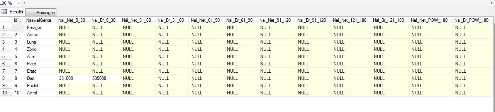

  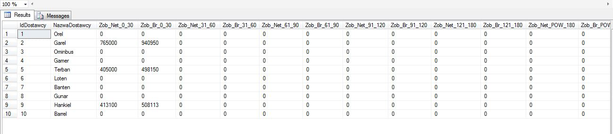

* 

* 

  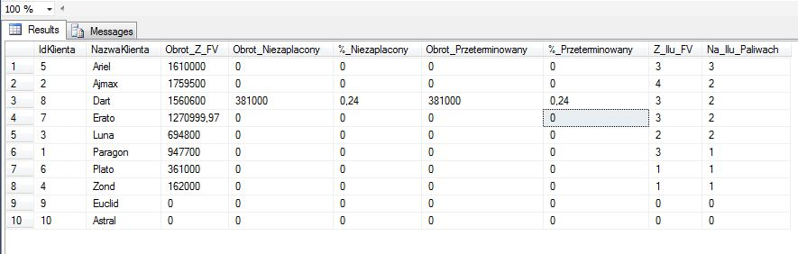

* 
* 

  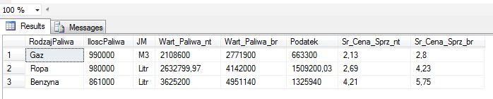

*  

  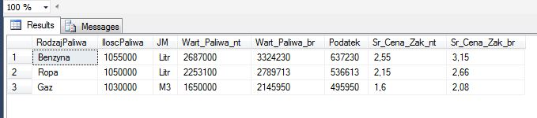

### Functions
* 
* 
* 
* 

### Views
* 

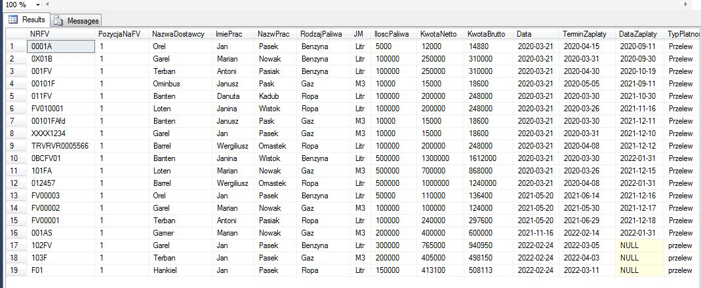

* 

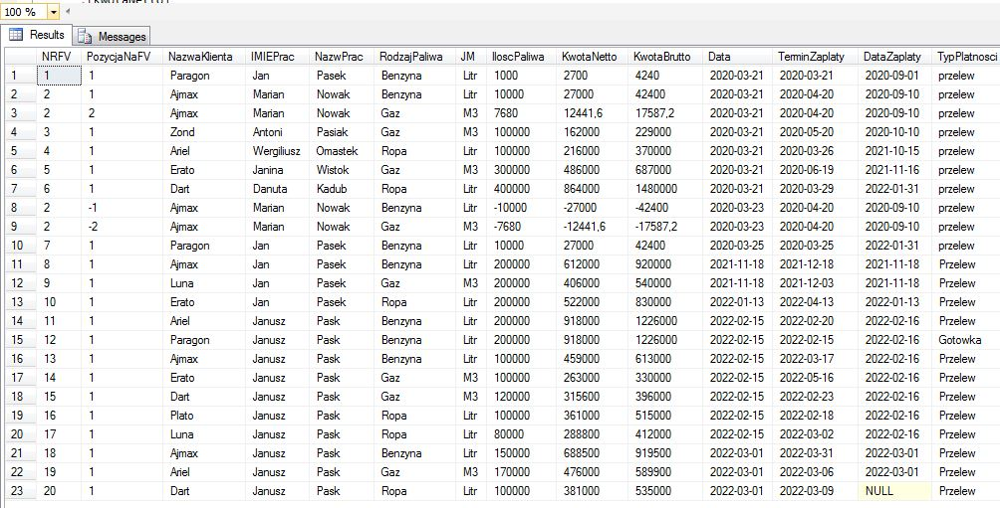

* 

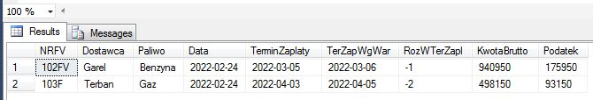

### Scripts
* 

	
## Technologies
Project is created with:
* Microsoft SQL Server 2014 

## Acknowledgements
Inspiration to this project was to join working experiance as financial analyst and  knowledge and also experience  in field of
SQL databases to show some examples of my skills.

	
## Setup
## Extras
*Automated pricing system 

