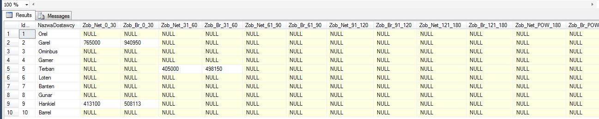

## Petrol Station

    Simplified simulation of petrol station.

## Table of contents
* [General info](#general-info)
* [Technologies](#technologies)
* [Features](#features)
* [Setup](#setup)
* [Acknowledgements](#Acknowledgements)
* [Extras](#Extras)

## General info
* Database diagram 

.JPG) 

## Features

### Stored Procedures
* 
* 
* 
  
* 
  
  
* 
* 
* 
* 
*  

### Functions
* 
* 
* 
* 

### Views
* 
* 
* 

### Scripts
* 

	
## Technologies
Project is created with:
* Microsoft SQL Server 2014 

## Acknowledgements
Inspiration to this project was to join working experiance as financial analyst and  knowledge and also experience  in field of
SQL databases to show some examples of my skills.

	
## Setup
## Extras
*Automated pricing system 

