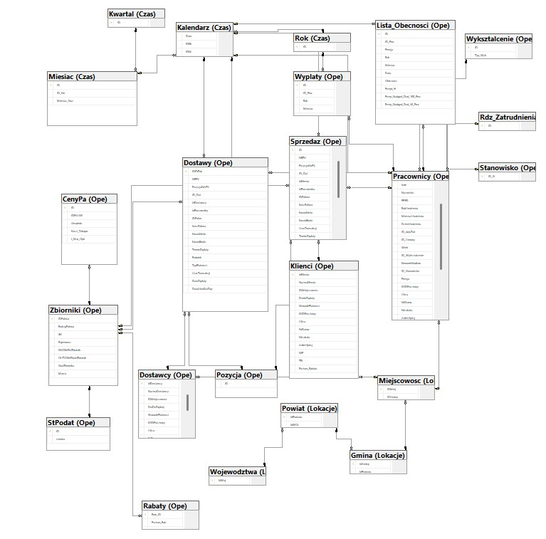
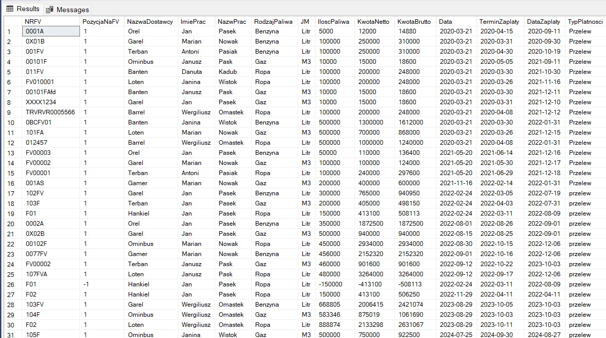
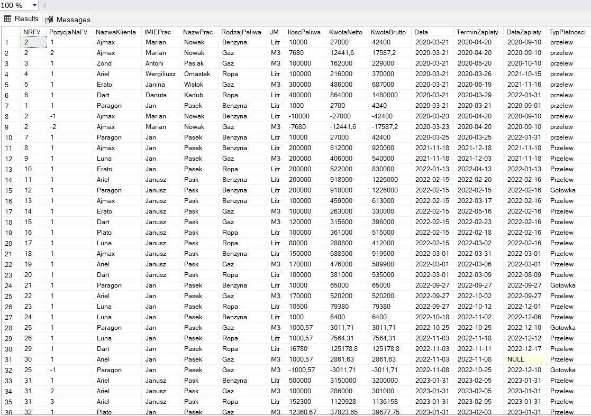
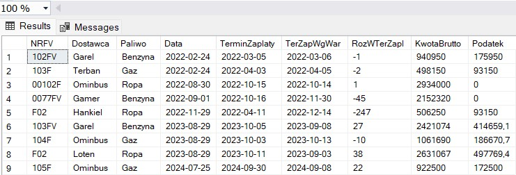

### Petrol Station

    Simplified simulation of petrol station.

### Table of contents
* [General info](#general-info)
* [Technologies](#technologies)
* [Features](#features)
* [Setup](#setup)
* [Acknowledgements](#Acknowledgements)

### General info
* Database diagram 

 
* Schemas:  
  
  Czas - represents time dimension  
  
  Lokacje - represents geographical dimension  
  
  Ope - represents operational activity of Petrol Station  
  
* Main tables in Czas Schema:  

  Czas.Kalendarz - Calendar table with dates and holidays  
  
* Main tables in Lokacje Schema:  

  Lokacje.Miejscowosc - table with Cities  
  
* Main tables in Ope Schema:  

  Ope.Zbiorniki - table with fuels  
  
  Ope.Klienci - table with customers data  
  
  Ope.Dostawcy - table with fuel suppliers data  
  
  Ope.Pracownicy - table with employees data  
  
  Ope.Sprzedaz - table with sales data  
  
  Ope.Dostawy - table with fuel's purchase data  
  
### Features

### Stored Procedures -> Time period for analysis presented on screenshots examples: years 2020-2024
* 

  

* 

  
    
* 

 Cash flow is divided into two periods: past and future (forecast).  
 If user provide data only from the past column 'Prognoza' will be empty.  
 If user provide data only from future column 'Realny' will be empty.  
 If user provide data which starts in past and ends in future cash flow   
 will be divided appropriately into this two columns ('Realny','Prognoza').   

  
    
* 

  

 Only short term debt including in measures.

* 

  

* 

* 

 Break event point gives answer how much a company needs to sell to cover  
 all costs (fixed and variable which refers to the volume of production).  
 When production is greater then estimated by BEP company is earning profit.  
 In some cases it is good to have a better precision and more flexible simulation.  
 Especially when we have more than one product with different margin levels and supply prices.  
 All calculations are in current margin levels, supply prices and costs.  
 BEP calculator is useful tool to answer questions like:  
 "How much litres of fuel type one we need to sell in current prices and in provided period of time,  
 if we sell one hundred litres of fuel type two and three or if we want to cover half fixed costs by selling fuel two."  
 We are able to provide such parameters:   
 - period of time  
 - fuel/s  
 - quantity for fuels or percentage of costs to cover  
 
 Which are represented by such parameters in BEP_Kalk stored procedure:  
 
 	@od = '2020-03-01',
	@do = '2024-12-31',
	@typ = N'Benzyna',
	@il = 2000,
	@ks_pro = NULL,
	@typ_1 = N'Gaz',
	@il_1 = NULL,
	@ks_pro_1 = 0.40
		
Which means that we wanted to know how much oil do we need to sell if we sell 2000 litres of petrol   
and we will simulate that we want to cover 40% of costs by selling gas.   
We are able to change the question flexible with parameters like costs level to cover and  
quantity to sell. We can mix it like that:  
 - we provide quantity for two fuels  
 - we provide quantity for one fuel and costs percentage to cover for second fuel  
 - we provide percentage costs to cover for two fuels  
 In every case we are able to provide data for two fules out of three.  
 
 The result of such query is shown on below screenshot:
 
 
 
 In this case we see that we don't have enough gas and oil in stocks if we want to keep strategy  
 with provided parameters. In this case we need to change margin levels to higher  
 or buy more gas and oil or combine all off it.  
 
* 

 The idea of customer segmentation is to choose correct parameters to describe real value of customers.  
 Choosen parameters are (in order from left to right according to below screenshot):  
 - income from invoices  
 - percentage of unpaid income from invoices calculated as unpaid income divided by income  
 - percentage of unpaid and overdue income calculated as unpaid and overdue income divided by income  
 - number of invoices  
 - number of bought fuels  

  

* 

  
  
* 

  

*  

  

### Functions
* 
* 
* 
* 

### Views
* 

* 

* 

### Automated pricing system 

It's a mechanism to ensure gross margin (without substracting costs like wages etc.) on desirable level. Sales price is caluclated from  
average fuel purchase price and margin. Every fuel has his own purhcase price which is average price for measure unit example litr, m3.   
Average price is result of dividing all net sum from supply invoices divided by all bought quantinty in measure units for every fuel.  
Desirable margin level is stored in column Marza in table . 
It can be updated by . The formula for sales price is: 
average purchase price for fuel multiplied by (1 + margin for this fuel).  
After every supply of fuel which is represented in , trigger trOilINZbior (code 
also available in ) changes current levels of fuels flow in table 
.  
After every DML event (without merge) made on table Zbiorniki trigger  updates 
sales prices to current level in table .
If new fuel will be added to table Zbiorniki trigger 
will update table CenyPa with new fuel.  
When sales invoice is made function  calculates net amount and function 
 calculates gross amount.

### Scripts
* 
	
### Technologies
Project created in:
* Microsoft SQL Server Express 2014 and 2022 

### Acknowledgements
Inspiration to this project was to join working experiance as financial analyst and  knowledge and also experience  in field of
SQL databases to show some examples of my skills.
