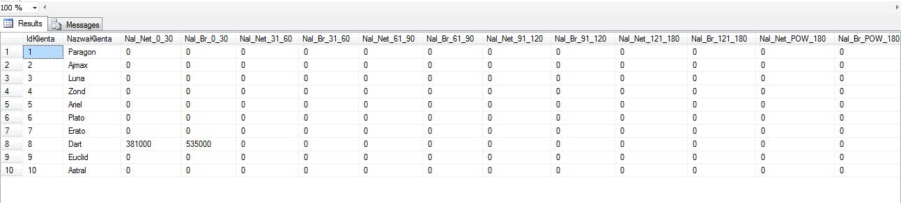
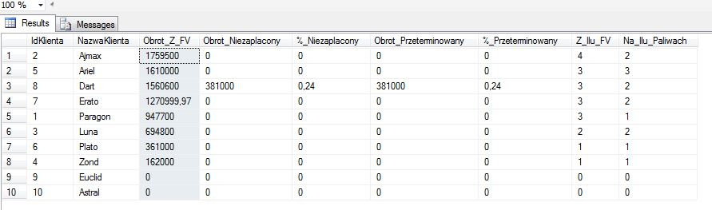

### Petrol Station

    Simplified simulation of petrol station.

### Table of contents
* [General info](#general-info)
* [Technologies](#technologies)
* [Features](#features)
* [Setup](#setup)
* [Acknowledgements](#Acknowledgements)
* [Extras](#Extras)

### General info
* Database diagram 

.JPG) 

### Features

### Stored Procedures -> Time period for analysis presented on screenshots examples: years 2020-2022
* 

  

* 

  
  
  
* 

 Cash flow is divided into two periods: past and future (forecast). If user provide data only from the past column 'Prognoza' will be empty.
 If user provide data only from future column 'Realny' will be empty.
 If user provide data which starts in past and ends in future cash flow will be divided appropriately into this two columns ('Realny','Prognoza').  

  
    

* 

  

* 

  

  

* 

 BEP calculator is useful tool to answer questions like:
 "How much litres of fuel one we need to sell in current prices and in provided period of time,
 if we sell one hundred litres of fuel two and three or if we want to cover half costs by selling fuel two."
 We are able to provide such parameters: 
 - period of time
 - fuel/s
 - quantity for fuels or percentage of costs to cover

* 

 The idea of customer segmentation is to choose correct parameters to describe real value of customers.
 Choosen parameters are (in order from left to right according to below screenshot): 
 - income from invoices
 - percentage of unpaid income from invoices calculated as unpaid income divided by income
 - percentage of unpaid and overdue income calculated as unpaid and overdue income divided by income
 - number of invoices
 - number of bought fuels

  

* 
* 

  

*  

  

### Functions
* 
* 
* 
* 

### Views
* 

* 

* 

### Automated pricing system 

It's a mechanism to ensure gross margin (without substracting costs) on desirable level. Sales price is caluclated from 
average fuel purchase price and margin. Every fuel has his own purhcase price which is average price for measure unit example litr, m3. 
Average price is result of dividing all net sum from supply invoices divided by all bought quantinty in measure units for every fuel.
Desirable margin level is stored in column Marza in table . 
It can be updated by . The formula for sales price is:
average purchase price for fuel multiplied by (1 +margin for this fuel).
After every supply of fuel which is represented in , trigger trOilINZbior (code
also available in ) changes current levels of fuels flow in table .
After every DML event (without merge) made on table Zbiorniki trigger  updates
sales prices to current level in table .
When sales invoice is made function  calculates net amount and function 
calculates gross amount.

### Scripts
* 

	
### Technologies
Project is created with:
* Microsoft SQL Server 2014 

### Acknowledgements
Inspiration to this project was to join working experiance as financial analyst and  knowledge and also experience  in field of
SQL databases to show some examples of my skills.

	
### Setup
### Extras

